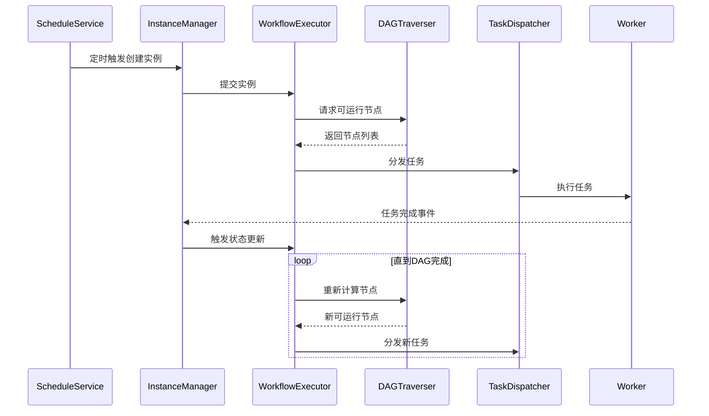

在 PowerJob 中，与 DAG 调度触发相关的核心代码主要集中在 **服务端（powerjob-server）** 模块，以下是关键的核心类及其职责：

---

### 1. **工作流调度引擎入口**
**`WorkflowInstanceManager`**
- 路径：`tech.powerjob.server.core.workflow.algorithm.WorkflowInstanceManager`
- 核心职责：
    - 工作流实例的生命周期管理（创建、启动、停止）
    - 触发工作流实例的初始调度
- 关键方法：
  ```java
  // 创建并启动工作流实例
  public void createWorkflowInstance(WorkflowInstanceCreateReq req) {
      // 1. 持久化工作流实例
      // 2. 提交到调度队列 (workflowReadyQueue)
  }
  ```

---

### 2. **DAG 调度核心处理器**
**`WorkflowExecutor`**
- 路径：`tech.powerjob.server.core.workflow.algorithm.WorkflowExecutor`
- 核心职责：
    - **DAG 状态机驱动**：推进工作流实例的状态流转
    - **任务节点调度**：根据 DAG 依赖关系触发任务执行
    - **容错处理**：失败重试、超时处理等
- 关键逻辑：
  ```java
  public void executeWorkflowInstance(Long wfInstanceId) {
      // 1. 加载DAG拓扑结构
      WorkflowDAG dag = workflowService.fetchWorkflowDAG(wfInstanceId);
      
      // 2. 计算可运行节点
      List<Node> runnableNodes = DAGUtils.calculateRunnableNodes(dag);
      
      // 3. 提交任务到任务调度器
      for (Node node : runnableNodes) {
          taskDispatcher.dispatch(node.toTaskInstance(), node.getNodeParams());
      }
  }
  ```

---

### 3. **DAG 图遍历与状态计算**
**`DAGTraverser`**
- 路径：`tech.powerjob.server.core.workflow.algorithm.DAGTraverser`
- 核心职责：
    - **依赖解析**：基于 DAG 图计算可执行节点
    - **状态传播**：处理节点完成/失败后的状态传递
- 关键算法：
  ```java
  public static List<Node> calculateRunnableNodes(WorkflowDAG dag) {
      // 实现拓扑排序算法
      return topologicalSort(dag)
          .stream()
          .filter(node -> isRunnable(node, dag)) // 检查前置依赖是否完成
          .collect(Collectors.toList());
  }
  ```

---

### 4. **任务触发执行器**
**`TaskDispatcher`**
- 路径：`tech.powerjob.server.core.scheduler.TaskDispatcher`
- 核心职责：
    - 将 DAG 节点转化为具体任务实例
    - 提交任务到工作线程池执行
- 关键代码：
  ```java
  public void dispatch(TaskInstance task, Map<String, String> params) {
      // 1. 创建任务实例记录
      taskInstanceService.save(task);
      
      // 2. 提交到执行器
      workerClusterManager.dispatchTask(
          task.getInstanceId(), 
          task.getTaskId(), 
          params
      );
  }
  ```

---

### 5. **回调处理器（状态推进引擎）**
**`WorkflowInstanceInfoService`**
- 路径：`tech.powerjob.server.core.service.WorkflowInstanceInfoService`
- 核心职责：
    - 监听**任务完成事件**
    - 触发工作流状态更新和后续节点调度
- 关键逻辑：
  ```java
  @EventListener
  public void onTaskInstanceStatusChange(TaskInstanceStatusChangeEvent event) {
      if (event.getStatus() == TaskResult.COMPLETED || event.getStatus() == TaskResult.FAILED) {
          // 更新DAG节点状态
          workflowService.updateNodeStatus(event.getTaskId(), event.getStatus());
          
          // 重新调度工作流实例
          workflowInstanceManager.resumeWorkflowInstance(
              event.getWfInstanceId()
          );
      }
  }
  ```

---

### 6. **调度器入口（定时触发）**
**`WorkflowScheduleService`**
- 路径：`tech.powerjob.server.core.scheduler.WorkflowScheduleService`
- 核心职责：
    - 扫描需要调度的**定时工作流**
    - 触发工作流实例创建
- 调度逻辑：
  ```java
  @Scheduled(fixedRate = 10_000)
  public void scheduleTimedWorkflow() {
      List<WorkflowInfo> timedWorkflows = workflowService.fetchTimedWorkflow();
      for (WorkflowInfo wf : timedWorkflows) {
          if (shouldSchedule(wf)) {
              workflowInstanceManager.createWorkflowInstance(
                  new WorkflowInstanceCreateReq(wf.getId())
              );
          }
      }
  }
  ```

---

### 核心执行流程


---

### 关键设计特点
1. **事件驱动架构**：通过任务完成事件驱动 DAG 状态流转
2. **拓扑排序算法**：使用 Kahn 算法实现高效依赖解析
3. **异步执行模型**：所有调度操作异步化，避免阻塞主线程
4. **状态机管理**：明确定义工作流实例的 6 种状态（WAITING/RUNNING/SUCCEED/FAILED/STOPPED）

建议重点关注以下包路径的源码：  
`powerjob-server/src/main/java/tech/powerjob/server/core/workflow/algorithm/`  
`powerjob-server/src/main/java/tech/powerjob/server/core/scheduler/`