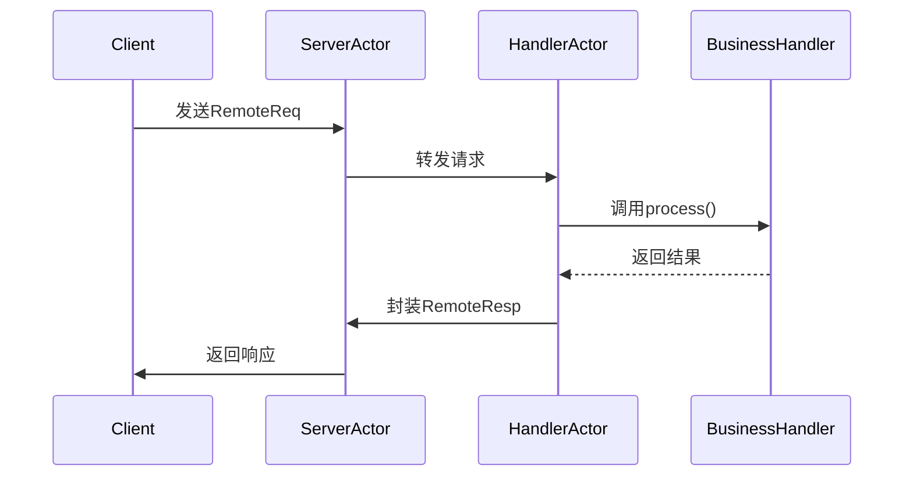

好的，我为您梳理了 PowerJob 中与 Akka 相关的核心代码实现部分。Akka 主要用于 PowerJob 的**分布式通信层**，特别是在服务端(Server)和客户端(Worker)之间的高性能网络通信中。以下是关键代码模块分析：

---

### 核心模块路径
```bash
powerjob-remote/akka-remote/src/main/java/tech/powerjob/remote/framework
```

---

### 核心实现类

#### 1. Akka 初始化与配置
**`AkkaRemoteEngine.java`**
- 位置：`tech.powerjob.remote.framework.engine.impl.AkkaRemoteEngine`
- 核心职责：
    - 初始化 Akka ActorSystem
    - 加载 Akka 配置（`application.conf`）
    - 创建根 Actor `ActorSystemHolder`
- 关键代码：
  ```java
  ActorSystem actorSystem = ActorSystem.create("powerjob-akka-system", akkaConfig);
  actorSystem.actorOf(Props.create(ActorSystemHolder.class, actorHandler), "holder");
  ```

#### 2. Actor 系统容器
**`ActorSystemHolder.java`**
- 位置：`tech.powerjob.remote.framework.actor.ActorSystemHolder`
- 核心职责：
    - 管理所有业务 Actor 的生命周期
    - 作为所有 Actor 的根监督者
    - 处理 Actor 的创建/销毁
- 关键方法：
  ```java
  private void initHandlers() {
      // 动态创建处理不同请求类型的Actor
      handlers.forEach(handlerInfo -> {
          String actorName = handlerInfo.getPath();
          getContext().actorOf(Props.create(HandlerActor.class, handlerInfo), actorName);
      });
  }
  ```

#### 3. 请求处理 Actor
**`HandlerActor.java`**
- 位置：`tech.powerjob.remote.framework.actor.HandlerActor`
- 核心职责：
    - 实际处理网络请求的 Akka Actor
    - 路由请求到对应的业务处理器
    - 实现异步非阻塞处理
- 核心逻辑：
  ```java
  @Override
  public Receive createReceive() {
      return receiveBuilder()
          .match(RemoteReq.class, this::onReceiveRemoteReq)
          .build();
  }
  
  private void onReceiveRemoteReq(RemoteReq remoteReq) {
      // 1. 反序列化请求
      // 2. 路由到对应业务处理器
      // 3. 异步处理并返回响应
  }
  ```

#### 4. 远程消息协议
**`RemoteProtocol.java`**
- 位置：`tech.powerjob.remote.framework.actor.HandlerActor`
- 核心类：
    - `RemoteReq`：封装请求数据
    - `RemoteResp`：封装响应数据
- 数据结构：
  ```java
  public class RemoteReq implements Serializable {
      private String path;       // 请求路径
      private byte[] payload;   // 二进制负载
      private Map<String, String> metadata; // 元数据
  }
  ```

#### 5. 序列化扩展
**`PowerAkkaSerializer.java`**
- 位置：`tech.powerjob.remote.framework.serializer.PowerAkkaSerializer`
- 核心职责：
    - 实现 Akka 的 `Serializer` 接口
    - 使用 Hessian2 进行高效二进制序列化
- 关键实现：
  ```java
  @Override
  public byte[] toBinary(Object object) {
      return SerializerUtils.hes.serialize(object);
  }
  
  @Override
  public Object fromBinary(byte[] bytes, Class<?> manifest) {
      return SerializerUtils.hes.deserialize(bytes);
  }
  ```

---

### 配置资源文件
**`application.conf`**
- 路径：`src/main/resources/application.conf`
- 核心配置：
  ```conf
  akka {
    actor {
      provider = cluster
      serializers {
        powerjob = "tech.powerjob.remote.framework.serializer.PowerAkkaSerializer"
      }
      serialization-bindings {
        "java.io.Serializable" = powerjob
      }
    }
    remote.artery {
      transport = tcp
      canonical.hostname = "127.0.0.1"
      canonical.port = 10000
    }
  }
  ```

---

### 执行流程
1. **初始化阶段**  
   `AkkaRemoteEngine` → 创建 `ActorSystem` → 初始化 `ActorSystemHolder`

2. **请求接收阶段**  
   网络请求 → 序列化为 `RemoteReq` → 路由到 `HandlerActor`

3. **业务处理阶段**  
   `HandlerActor` → 解析请求 → 调用业务处理器 → 生成 `RemoteResp`

4. **响应返回阶段**  
   序列化响应 → 通过 Akka 网络层返回 → 客户端反序列化

---

### 设计特点
1. **高性能传输**  
   使用 Artery TCP 传输层，支持百万级 QPS
2. **零拷贝优化**  
   通过 ByteBuffer 实现二进制零拷贝传输
3. **弹性扩展**  
   基于 Actor 模型的横向扩展能力
4. **协议无关性**  
   业务处理器无需感知 Akka 实现细节

---

### 示例调用栈


建议结合源码查看以下关键包路径：  
`tech.powerjob.remote.framework.actor`  
`tech.powerjob.remote.framework.engine.impl`  
`tech.powerjob.remote.framework.serializer`

这些模块共同构成了 PowerJob 基于 Akka 的高性能分布式通信基础架构。